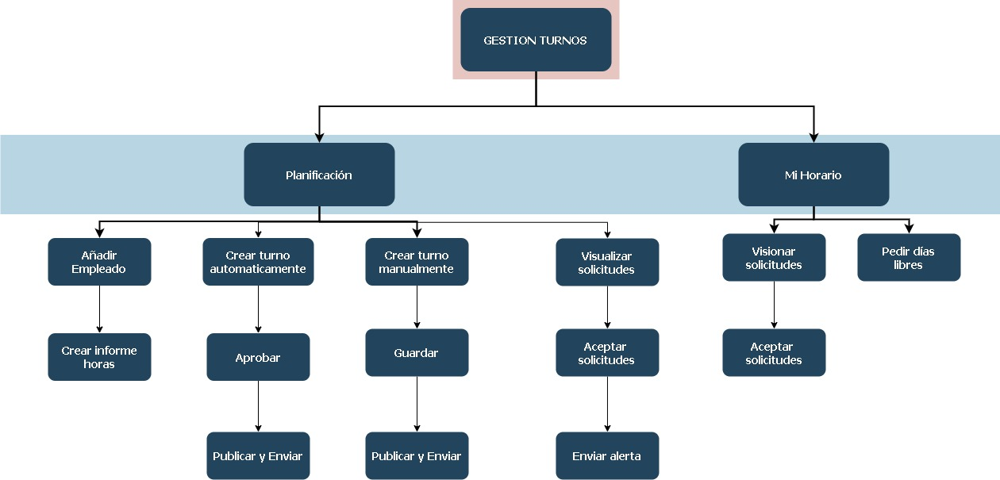
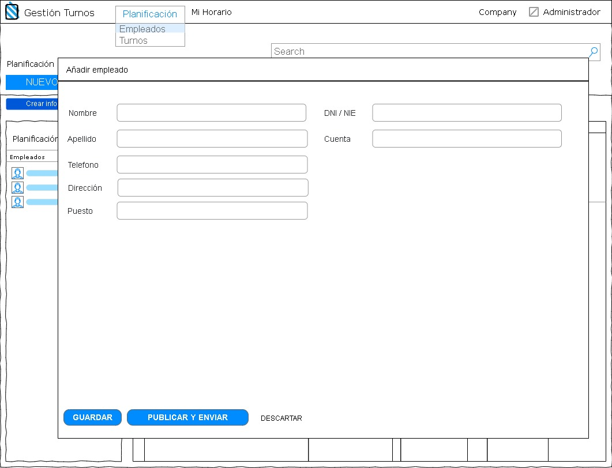
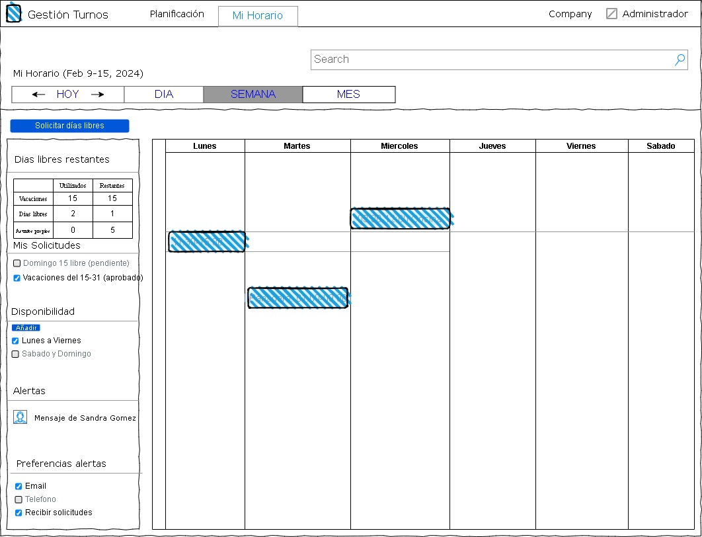
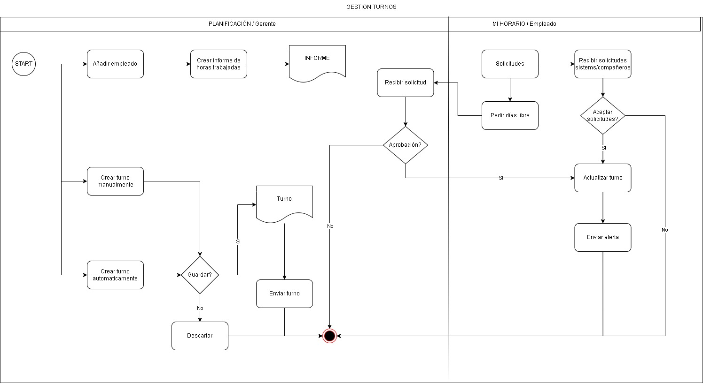

---
# Feel free to add content and custom Front Matter to this file.
# To modify the layout, see https://jekyllrb.com/docs/themes/#overriding-theme-defaults

layout: page
title: Gestion-Turnos
---

### DESCRIPCIÓN
Simplifica la creación de horarios y aumenta la productividad. Gestiona a la perfección los turnos y los recursos y disfruta de una nueva coordinación eficiente entre tus empleados.

### DESCRIPCIÓN DETALLADA

1. PLANIFICACIÓN:
	- Añadir empleados y asignarle un rol de trabajo.
    - Podremos crear nuevos turnos y asignarlos a nuestros empleados y enviárselos al correo, además de poder publicarlo en el calendario para que lo vea toda la plantilla. 
	- Además, podrán dejar horas / turnos abiertos en el calendario de la empresa que se podrían dar por bajas o vacaciones. Así mismo, los empleados que quieran hacer más horas podrán apuntarse y solicitarlos al administrador.

2. MI HORARIO:
	- Aquí el empleado podrá ver su horario y turnos asignados. Además, podrá pedir días libres para asuntos propios, días por enfermedad o vacaciones. A su vez el administrador podrá aceptar la solicitud o denegarla.
	- Hay una posibilidad de que los empleados se puedan intercambiar algunos turnos de trabajo entre ellos a modo de favor o emergencia que a priori sería muy precipitado pasar por la aprobación de un administrador.
	- También podrán apuntarse para hacer más horas en los huecos que se podrían dar en los turnos.
	- Tendrán una lista con todos sus días libres disponibles, ya sea para asuntos propios o vacaciones. También habrá otra con todos los días libres ya tomados a lo largo del año.
	- Además, los empleados podrán dejar por escrito su disponibilidad en caso de emergencia o cambio de turnos, eso sería muy práctico para los empleados a media jornada que quieran más horas. Ellos podrían pedir ser avisados si hay algún hueco disponible.

3. INFORMES
	- El módulo también nos facilita el seguimiento de las horas trabajadas por cada empleado y podrá generar informes para la gestión de nóminas y cumplimiento laboral.
	- Así mismo, el módulo podrá alertar al supervisor sobre posibles conflictos o ausencias o simplemente, cada vez que haya un cambio.
	- Teniendo en cuenta los turnos asignados todas las semanas, nos genera automáticamente los turnos del mes siguiente. El gerente lo podrá revisar y dar el visto bueno antes de publicarlo.
	- El sistema podrá predecir la demanda teniendo en cuenta los días de la semana, los días festivos o las horas del día, y asignar automáticamente más personal cuando sea necesario para lidiar con la oleada de clientela. 
    - Otra cosa que podrá hacer el sistema es avisar automáticamente, al empleado que ha rellenado su disponibilidad, de un hueco en los turnos, y este podrá aceptar la solicitud o denegarla.

### MAPA

### WIREFRAME

Wireframe del TAB de ‘Planificación’ de la sección de ‘Empleados’.

Wireframe del TAB de ‘Planificación’ de la sección de ‘Empleados’ y la función ‘Añadir Empleado’.

Wireframe del TAB de ‘Planificación’ de la sección de ‘Turnos’.

Wireframe del TAB de ‘Planificación’ de la sección de ‘Turnos’ y la función ‘Crear turno’.

Wireframe del TAB de ‘Mi Horario’.

### CONTROL DE ACCESO

1. Grupos: administradores, empleados.
2. Acceso al módulo: todos los usuarios.
3. Administradores: acceso a ‘Planificación’, ‘Mi Horario’ 
	- Permiso de lectura y escritura a todos los módulos.
4. Empleados: acceso a ‘Mi Horario’, ‘Planificación’.
	- ‘Mi Horario’: acceso de lectura.
	- ‘Planificación’: acceso de lectura.

### DIAGRAMAS DE FLUJO

Diagrama de flujo del TAB de ‘Planificación’ y ‘Mi Horario’.

### ESQUEMA RELACIONAL DE LAS NUEVAS TABLAS

