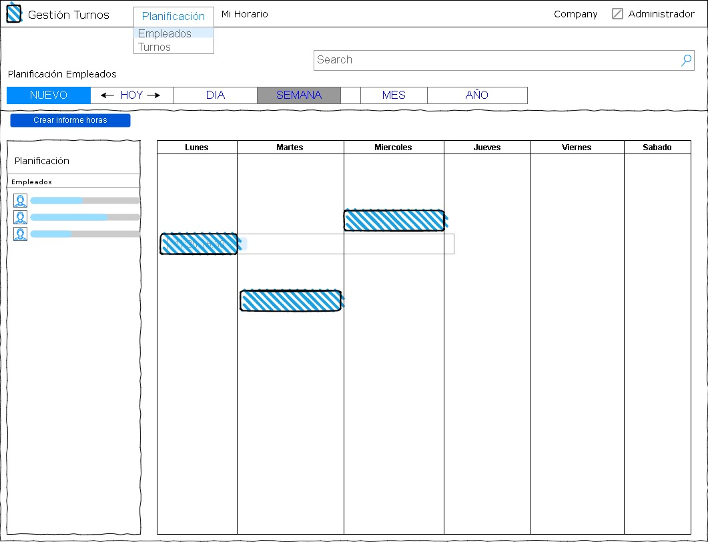
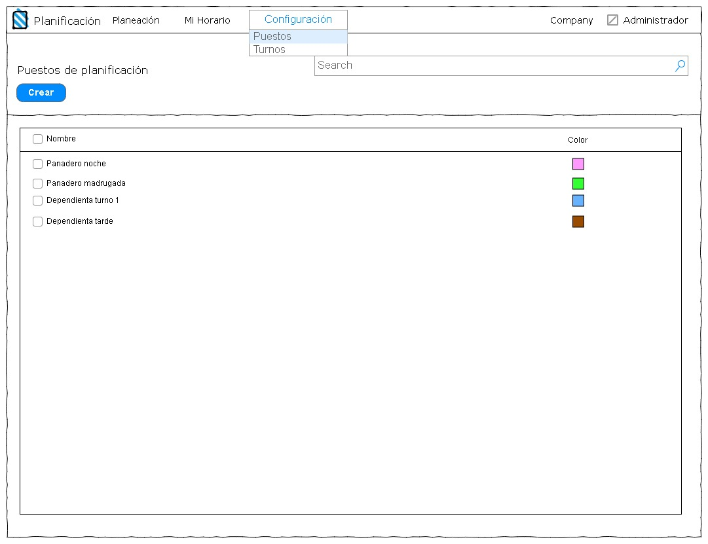
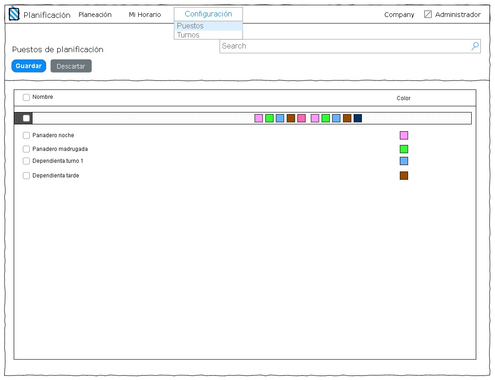
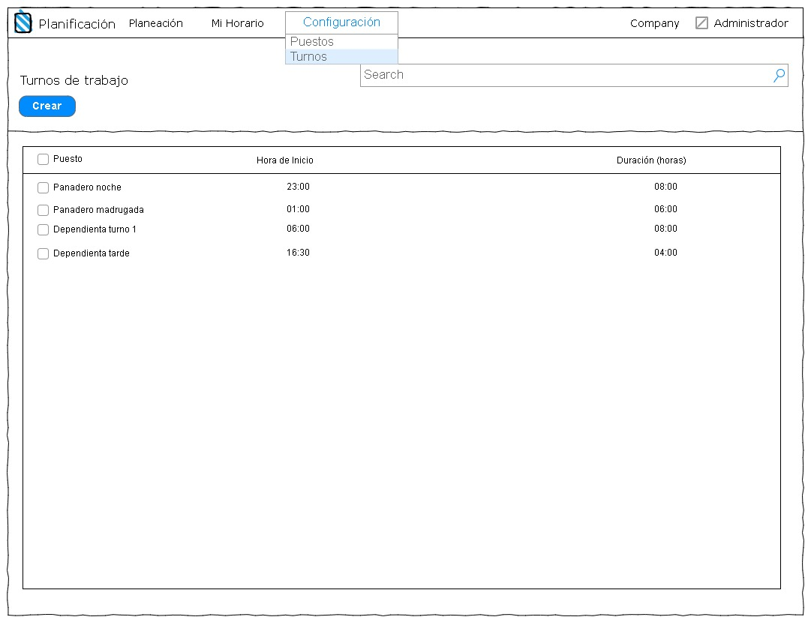
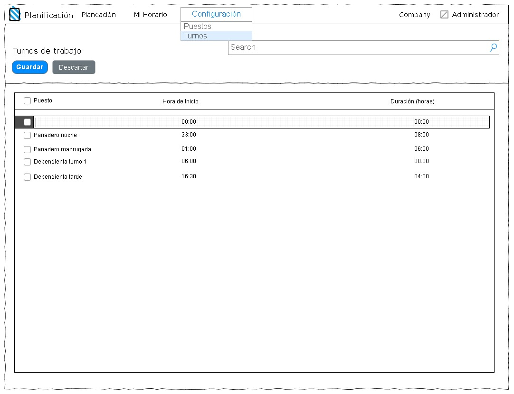
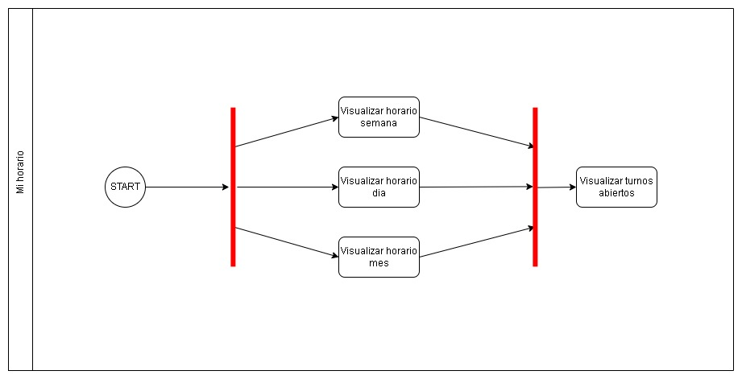
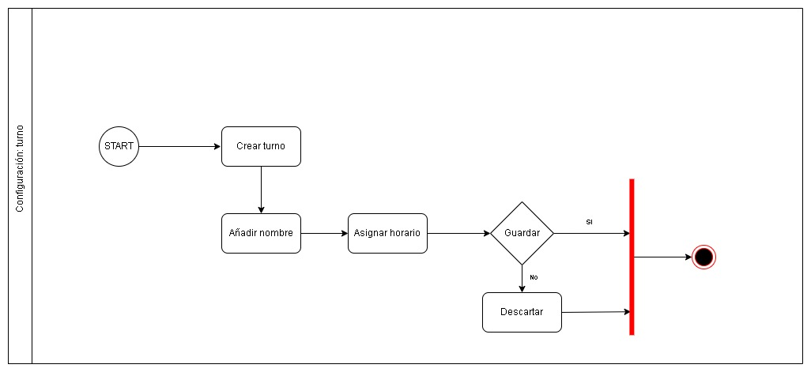
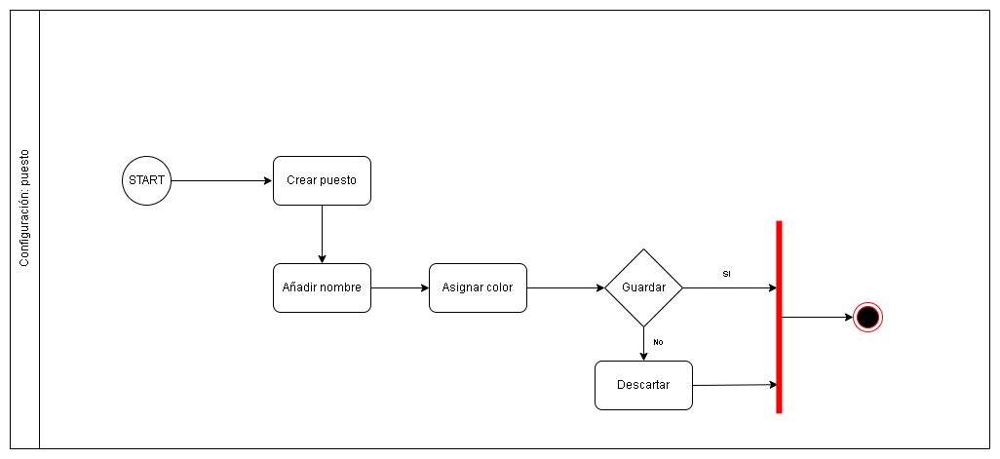
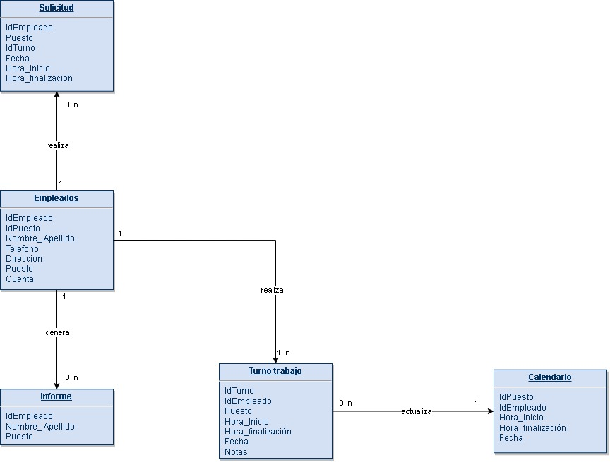

---
# Feel free to add content and custom Front Matter to this file.
# To modify the layout, see https://jekyllrb.com/docs/themes/#overriding-theme-defaults

layout: page
title: Planificación Modulo 1
---
# Planificación
NOMBRE: planificación
DESCRIPCIÓN
Simplifica la creación de horarios y aumenta la productividad. Gestiona a la perfección los turnos y los recursos y disfruta de una nueva coordinación eficiente entre tus empleados.

DESCRIPCIÓN DETALLADA
TAB_Planeación:
-	Podremos gestionar todos los turnos y organizarlos en tablas por puesto o por empleado.
-	Podremos deja turnos sin asignar y asignarlos posteriormente con facilidad.
-	Posibilidad de enviar a los empleados sus respectivos horarios.
-	Posibilidad de copiar todos los turnos de la semana anterior y reorganizarlos.
-	Planeación: mostrar los turnos en una tabla.
-	Ver horarios por dia, semana, mes, año.
TAB_Mi Horario
-	Los empleados podran ver y gestionar sus horarios en una tabla.
-	Turnos abiertos disponibles: los empleados pueden ver los turnos abiertos disponibles.
-	Podremos verlo por dia, semana y més.
TAB_Configuración
-	Podremos crear turnos y puestos de trabajo con el boton de ‘CREAR’.

MAPA MODULO 1

DEPENDENCIAS DE OTROS MODULOS
Modulo 1 depende de: Empleados. Necesitamos la lista de empleados.

WIREFRAME

Wireframe del TAB de ‘Planeación’ de la sección de ‘Por Empleado’.

Wireframe del TAB de ‘Planeación’ de la sección de ‘Por Empleado’ y la función ‘Añadir turno’.

Wireframe del TAB de ‘Planeación’ de la sección de ‘Por Puesto’.

Wireframe del TAB de ‘Planeación’ de la sección de ‘Por Puesto’ y la función ‘Añadir turno’.

Wireframe del TAB de ‘Mi Horario’.

Wireframe del TAB de ‘Configuración’ de la sección de ‘Puestos’.

Wireframe del TAB de ‘Configuración’ de la sección de ‘Puestos’ y la función ‘Crear’.

Wireframe del TAB de ‘Configuración’ de la sección de ‘Turnos’.

Wireframe del TAB de ‘Configuración’ de la sección de ‘Turnos’ y la función ‘Crear’.

CONTROL DE ACCESO
Grupos: administradores, empleados.
Acceso al modulo: todos los usuarios.
Administradores: accesso a ‘Planeación’, ‘Mi Horario’ y Configuración
	- Permiso de lectura y escritura a todos los modulos.
Empleados: acceso a ‘Mi Horario’, ‘Planeación’.
	- ‘Mi Horario’: acceso de lectura.
	- ‘Planeación’: acceso de lectura.

DIAGRAMAS DE FLUJO

Diagrama de flujo del TAB de ‘Planeación’.

Diagrama de flujo del TAB de ‘Mi Horario’.

Diagrama de flujo del TAB de ‘Configuración’ y de las subTabs de ‘Por Turno’ y ‘Por Puesto’.

ESQUEMA RELACIONAL DE LAS NUEVAS TABLAS

CARACTERISTICAS COMUNICACIÓN
Modulo 1: comunica con empleados 
Requisitos: acceso a la lista de empleados del modulo ‘Empleados’
Protocolo/ Formato del mensaje: podemos utilizar RPC (es una llamada remota a procedimientos para invocar funciones de otros módulos) o también podemos hacer uso de una base de datos compartida.
Estructura Mensaje RPC

                        module1/models/module1_model.py
                        from odoo import models, api
                        class Module1Model(models.Model):
                            _name = 'module1.model'

                            @api.model
                            def call_remote_function(self, data):
                                module2_model = self.env['module2.model']
                                result = module2_model.process_data_remotely(data)
                                # Procesar el resultado si es necesario
                                return result

